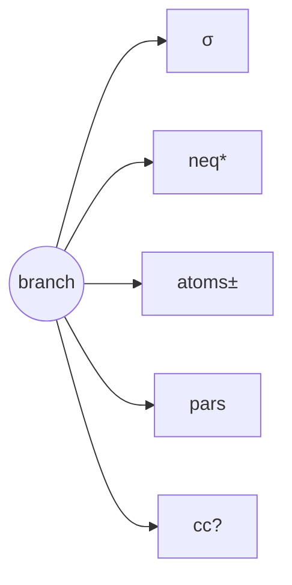
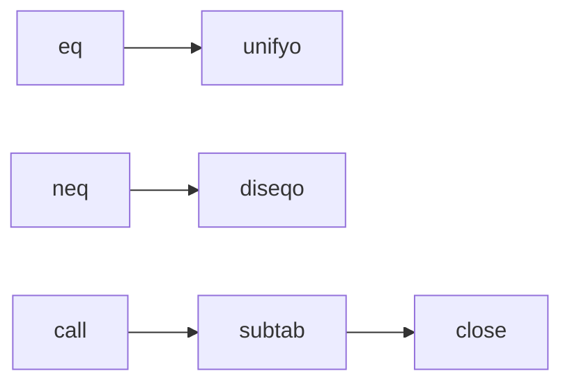

# Proflog Equality

## Executive Summary

Implement **B**: occurs-checking `unifyo` + symbolic `diseqo` over the **free-constructor Herbrand term algebra**. In Fitting’s weak Herbrand setting, Reflexivity is identity, Substitutivity is congruence on walked terms, Free Closure is constructor clash, and One-One is same-head decomposition; this fits αleanTAP/core.logic’s pure relational style better than host rewriting. citeturn0search0turn0search8turn5view1turn2search0

## Semantics

Family **A** replays equality by rewriting/paramodulation; **B** compiles equality into branch state. For Proflog-on-core.logic, B is the semantic kernel; A is, at most, proof replay or later optimization. citeturn0search8turn6view3turn1search0

| fam | complexity | risk | purity |
|---|---|---|---|
| A | high | high | low |
| B | medium | lower | high |

## Kernel

Use `st={σ,neq*,atoms±,pars,pf,cc?}` where `σ` is **triangular**, `neq*` is a solved-form disequality store, `pars` are rigid internal δ-constants, `pf` stores equality/procedure-call evidence, and `cc` is a **derived** congruence cache only. Answers must be `L`-terms: no `par`, no non-`L` symbols. citeturn4view0turn4view4turn0search6turn3view2turn1search1

## Relations

`unifyo`: walk; same term→success; var bind if acyclic; same-head apps recurse; different constructors fail. `diseqo`: try unify; unify-fails→success; same `σ`→branch fails; extended `σ`→store new prefix mini-substitution. `branch-close-checko` compares **walked** complementary atoms; `answer-admissibleo` rejects `par`. citeturn4view4turn3view0turn2search0

## Tradeoffs

Symbolic disequalities are the default. Enumerate disunifiers only for bounded UI/case-split modes or explicit ground-only answer materialization. Allowed optimizations: profiling, derived `cc`, bounded enumeration, tabling; any core.logic patch requires **ADR + AAR** stating intent, rationale, semantic effect, and success/failure. Never hide `project`, committed choice, or `run-nc` in the kernel. citeturn0search3turn1search2turn3view0turn4view2turn4view3turn3view1

## Tests

Required: clash, injectivity, `x≠a`, `x=f(x)` rejection, quantified substitution, equality in subsidiary tableaux, negative equality with free vars, proof replay, and bounded Herbrand small-model oracle checks against a direct constructor evaluator. citeturn0search0turn0search8turn1search0turn0search3

## Sources and Gaps

Searched: Fitting paper/book; αleanTAP and leanTAP; core.logic docs/repo; cKanren; Byrd dissertation; Comon–Lescanne; Nelson–Oppen; proof-producing congruence closure. Gap: no canonical public implementation of **pure Proflog + equality on core.logic** was found, so Codex should treat this as greenfield with adjacent precedent, not a port. citeturn0search0turn0search1turn0search5turn0search2turn1search2turn1search3turn0search3turn1search0turn1search1

## Codex Checklist

Inline-comment every relation for a new developer. Preserve invariants: acyclic `σ`; every bind rechecks `neq*`; clash closes immediately; same-head equality decomposes; `cc` rebuildable from `σ`+evidence; no `par` escapes; proof evidence replayable. Ship ADRs, AARs, test matrix, and a “semantic variants” doc before any optimization lands. citeturn4view0turn4view4turn5view0turn2search0