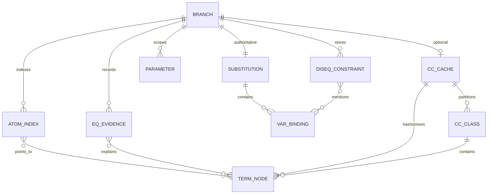
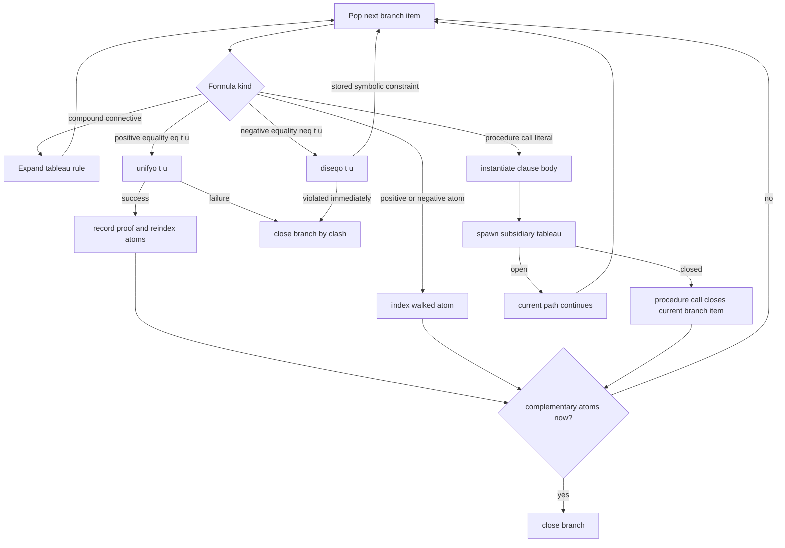

# Equality for Proflog as Free-Constructor Term Equality

## Executive summary

For a greenfield Proflog atop αleanTAP and miniKanren, equality should be implemented as **free-constructor equality over the object-language term algebra**, not as host-language rewriting or a separate paramodulation-style equality engine in the kernel. That recommendation is not merely an engineering convenience. It follows from Fitting’s own semantic setting for Proflog: his weak Herbrand models require function symbols to be one-one in their arguments and to have non-overlapping ranges, including the constant-symbol cases. In that setting, equality behaves like equality in a free term algebra: reflexivity is immediate, “equals for equals” is congruence/substitutivity, same-headed equalities decompose argumentwise, and different constructors clash. The key consequence is that the operational core for positive equality can be **occurs-checking unification**, while negative equality can be a **symbolic disequality constraint store**. citeturn4view0turn6search7turn10view1turn29view3

On that basis, the best kernel architecture is a **purity-first relational solver** with four authoritative components in branch state: a triangular substitution, a symbolic disequality store, scoped δ-parameters represented as rigid internal constants, and proof evidence. A branch-local congruence structure may be added later, but only as a **derived cache** whose contents are reconstructible from the substitution and equality evidence; it should not be part of the semantic truth source in milestone one. That recommendation aligns with αleanTAP’s design goal of being a pure relation, with miniKanren’s general relational philosophy, and with cKanren/core.logic’s treatment of disequality as symbolic constraints rather than eager domain enumeration. citeturn0search5turn20view1turn27view1turn13view2turn17view0turn19view3

The competing family of implementations—host rewriting, explicit repeated equality-rule application, or resolution-style paramodulation—has a legitimate proof-theoretic pedigree, and Fitting’s theorem-proving book discusses both tableau replacement rules and paramodulation. But in a miniKanren setting it is a worse fit for three reasons. It duplicates machinery the host logic engine already has; it tends to require aggressive rule scheduling and heuristics just to stay tractable; and it creates strong pressure toward non-relational host operations such as projection, committed choice, or ad hoc structural rewriting. Fitting himself warns that implementable equality procedures need careful control and heuristics, while Byrd’s dissertation is explicit about the relational cost of impure operators like `project`, `conda`, and `condu`. citeturn10view1turn23view0turn26view0turn26view1turn26view2

The completeness boundary should be documented precisely. For **free-constructor equalities and disequalities**, unification plus solved-form disequality constraints is the right complete substrate. Overall Proflog completeness is then limited by tableau search strategy, not by the equality representation itself. Enumeration of concrete disunifiers should therefore be treated as an **answer-format or search-control choice**, not as the default semantics of negative equality. In most cases, Proflog should return symbolic residual disequalities; only ground-only frontends, constructor-case splitting, or specific downstream proof obligations justify bounded disunifier enumeration. That division matches the disequality literature’s emphasis on solved forms and control, and it matches miniKanren practice, where symbolic constraints are preferred to explicit enumeration of infinite domains. citeturn32view0turn17view0turn18view0turn15view3

The exact host language is **unspecified** in the request. The API sketches below therefore use **miniKanren/core.logic-style notation** because that is the relevant semantic and implementation target, not because Clojure has been assumed as a hard requirement. core.logic’s official API materially supports the design: it exposes a constraint store, complex-term disequality, nominal support, tabled goals, and a separate `run-nc` family that explicitly disables occurs-checking and therefore should not be used in the Proflog equality kernel. citeturn3view3turn13view2turn14view0

## Equality semantics in Proflog

Fitting’s Proflog is not based on arbitrary first-order models. Its denotational account is tied to **weak Herbrand models**, and the paper’s defining equality-adjacent conditions are exactly the ones that make “constructor equality” the natural operational reading: each function symbol is one-one in its arguments, and distinct function symbols have non-overlapping ranges; constants count as zero-place function symbols, so distinct constants also denote distinct elements, and no proper function application can equal a constant. That is the semantic reason that free-constructor term equality is the right target for Proflog’s equality layer. citeturn6search7turn4view0

At the proof-theoretic level, Fitting’s equality machinery in tableaux is built from **reflexivity** and **replacement/substitutivity**. In the basic tableau system, `t = t` may be added to a branch, and if `t = u` and a formula `φ(t)` occur on a branch, then `φ(u)` may be added as well. Fitting also notes that, for the equality tableau systems he develops, replacement can remain complete even when restricted operationally to atomic or simple formulas, which matters for implementation. In the free-variable implementation discussion, he goes further and explicitly combines equality replacement with **most-general unification**. citeturn10view1turn9view2turn10view3

That gives the direct mapping below.

| Fitting rule or condition | Free-constructor reading | Operational consequence |
|---|---|---|
| Reflexivity | Every term is equal to itself | `eq(t,t)` succeeds immediately |
| Substitutivity | Equality is a congruence; equals may replace equals in atomic contexts | normalize/walk atoms under the current substitution and equality evidence instead of explicitly rewriting formulas |
| One-One | If `f(s1,...,sn) = f(t1,...,tn)`, then corresponding arguments are equal | same-head unification decomposes equality into argument equalities |
| Free Closure | Distinct constructors have disjoint ranges; constants and proper applications never collapse | constructor clash fails immediately; disequality of unmatched constructors succeeds immediately |

The factual basis for the table is Fitting’s weak Herbrand semantics plus his tableau equality rules; the implementation reading is the design inference that follows from them. citeturn6search7turn10view1turn29view3turn10view3

The strongest theoretical point is that **substitutivity need not be implemented as explicit host-level rewriting**. In a free-constructor relational kernel, substitutivity is realized by the fact that terms are always interpreted under the current substitution and equality store before atom indexing or branch-closure checks. That is, one does not repeatedly rewrite `P(t)` into `P(u)` at the object level; one evaluates both against a shared canonical branch state. Fitting’s observation that replacement can be restricted to atomic/simple contexts, together with his MGU-based equality implementation strategy, strongly supports that compilation of substitutivity into canonicalization. citeturn9view2turn10view3

A second foundational point concerns **parameters**. Fitting’s tableau systems reason over an extension `Lpar` of the user language `L` obtained by adding fresh parameters, and he is explicit that δ-style proof steps use parameters that are new and that do not belong to the original language. In a Proflog kernel this should become an internal constructor such as `['par p]`: rigid for proof search, fully usable by equality and disequality internally, but forbidden at the answer boundary. That is the correct analogue of “proofs use `Lpar`, answers belong to `L`.” citeturn29view1turn29view3

## Comparing the implementation families

There are two serious implementation families.

**Family A** treats equality as an explicit theorem-proving subsystem: host-language rewriting, repeated application of replacement rules, or resolution-style paramodulation. This family matches the surface appearance of textbook equality rules, and it can yield proof objects that resemble classical equality derivations. Fitting’s theorem-proving book discusses tableau replacement directly and then turns to paramodulation as the best-developed implementable equality treatment on the resolution side. citeturn10view1turn23view0

**Family B** treats equality the way a free term algebra wants to be treated: positive equalities are delegated to unification, negative equalities to a disequality store, and branch-local congruence is represented either implicitly by the substitution or by an optional derived explanation cache. This family matches miniKanren’s architecture. core.logic explicitly exposes substitutions, constraint stores, complex-term disequality, nominal support, and tabled goals; Byrd’s dissertation and the cKanren work both show that symbolic disequalities can be represented concisely as mini-substitutions and maintained declaratively. citeturn3view3turn13view2turn17view0turn18view0turn19view0turn19view2

The practical comparison is as follows.

| Criterion | Family A: explicit rewriting or paramodulation | Family B: unification plus disequality store |
|---|---|---|
| Semantic fit to Fitting weak Herbrand equality | Indirect; works, but re-implements free-constructor behavior procedurally | Direct; constructor clash and injectivity fall out of unification and disequality |
| Fit to αleanTAP/miniKanren purity | Weak to medium; encourages host inspection and control heuristics | Strong; aligns with pure relational search and symbolic constraints |
| Implementation burden | High; scheduling replacement/paramodulation is nontrivial | Moderate; leverages existing substitution and constraint infrastructure |
| Search behavior | Heuristic-heavy; equality steps can explode | Better localized; equality mostly updates branch state |
| Proof explanation quality | Naturally explicit | Good if equality proofs are recorded or a proof-producing cache is added |
| Risk of extra-logical leakage | High | Lower, if `run-nc`, `project`, and committed choice stay out of the kernel |
| Extension path toward relational arithmetic | Poorer; duplicates reasoning layers | Better; clean CLP-style composition boundary |

The “semantic fit” and “implementation burden” judgments are design conclusions. Their factual basis is that Fitting’s equality systems require careful control and heuristics in implemented proof search, while miniKanren and cKanren already natively organize equality and disequality around substitutions and constraint stores. Fitting even remarks that complete implemented equality procedures may be painfully slow without good heuristics; Byrd, in parallel, emphasizes avoiding impure operators because they damage declarativity and mode freedom. citeturn23view0turn17view0turn19view3turn26view0turn26view3

The purity issue is decisive for Proflog-on-αleanTAP. Byrd’s dissertation gives two especially relevant warning signs: `project` is explicitly non-relational, and operators like `conda` and `condu` are non-declarative pruning devices analogous to Prolog’s cut. If equality is implemented by host rewriting over projected values, the resulting prover may still “work forward,” but it will no longer retain αleanTAP’s most valuable property: the ability to run backward, synthesize terms, and accept partial proof guidance with clean logical meaning. citeturn26view0turn26view2turn20view1turn20view3

Family A is not wrong in the abstract. It is simply the wrong default for this substrate. In a conventional theorem prover, paramodulation is a natural equality engine. In a relational Proflog atop miniKanren, it is usually a sign that the design has failed to exploit the substrate’s native strengths. citeturn23view0turn3view2

## Recommended relational equality kernel

The recommended kernel keeps two ideas separate: the **authoritative relational state**, and any **derived performance cache**. The authoritative state is what the semantics depends on; the cache is optional, rebuildable, and removable without changing answers. That separation is essential if the kernel is to remain purely relational. citeturn19view3turn26view2turn27view1



The authoritative branch state should be a persistent record conceptually equivalent to the following.

| Field | Role |
|---|---|
| `σ` | triangular substitution for host logic variables |
| `neq*` | symbolic disequality constraints, each stored as a mini-substitution |
| `atoms+`, `atoms-` | normalized positive and negative atom indexes for complementary closure |
| `eq-evidence` | proof objects for asserted equalities and derived equalities |
| `pars` | branch-local δ-parameters |
| `proof` | tableau/procedure-call proof spine |
| `cc-cache` | optional derived congruence/explanation cache, never authoritative |

This state shape follows the miniKanren/core.logic substitution-and-constraint model, Byrd’s use of triangular substitutions, and cKanren-style symbolic constraint handling. The optional `cc-cache` is justified by the congruence-closure literature, but it should be treated as an optimization profile, not as the semantic core. citeturn3view3turn15view0turn17view0turn19view2turn3view6turn25view3

Substitutions should be **triangular**, not fully idempotent. Byrd explicitly argues for triangular substitutions and walk-based lookup, and he reports significant performance advantages while preserving a relational presentation. That is especially useful here because equality will extend substitutions frequently and disequality verification wants efficient access to “just the new bindings.” In fact, Byrd’s disequality implementation exploits exactly that property: new bindings form a prefix, which makes mini-substitution extraction simple. citeturn15view0turn17view1

Disequalities should be stored **symbolically** in solved form, not enumerated eagerly. Byrd’s presentation is directly adaptable: a disequality constraint is represented as a list of variable–term pairs, which is “a mini-substitution that indicates which simultaneous variable associations would violate the constraint.” After every successful unification, the store is re-verified and simplified. This gives a clean rule for negative equality: if the candidate equality cannot ever be realized, the disequality succeeds trivially; if it is already realized, the branch fails; if it could become realized later, a new symbolic constraint is retained. citeturn15view2turn17view0turn17view1

Occurs-checking is non-negotiable. core.logic’s API explicitly distinguishes normal execution from `run-nc` and `run-nc*`, which “do not occurs-check.” Byrd likewise shows that no-check disequality and no-check unification can introduce circular constraints and even divergence at reification time. Since Proflog equality is intended to model finite free-constructor terms, not rational-tree equality, the kernel must use occurs-checking unification throughout and must reject no-check fast paths as semantic variants, not hidden optimizations. citeturn13view1turn13view3turn18view0

δ-parameters should be treated as **rigid internal constants**. They are introduced the way Fitting introduces parameters in `Lpar`: new to the branch, usable in proof search, but not part of the original language `L`. The equality solver should therefore treat `['par p]` exactly like a fresh constructor constant during proof search; the answer projector, however, must accept only reified terms that are parameter-free and use symbols from the original language declaration. citeturn29view1turn29view3

Proof terms should be recorded even in Family B. αleanTAP already uses proof terms as first-class data, and proof-producing congruence closure literature shows that efficient explanation recovery is possible without abandoning fast closure algorithms. The right proof vocabulary here is not a classical equational derivation tree divorced from branch state; it is a compact explanation DAG with constructors such as `refl`, `assume-eq`, `bind`, `cong`, `symm`, `trans`, `clash`, `neq-store`, `comp-atom-close`, and `proc-call-close`. citeturn20view3turn25view2

The exact host language is unspecified, so the following sketches are intentionally **core.logic/miniKanren-flavored abstractions**, not drop-in code for a particular runtime. citeturn3view3turn3view2

```clojure
;; Authoritative relations

(unifyo                term term branch-state branch-state proofeq)
(diseqo                term term branch-state branch-state proofneq)
(congruence-updateo    eq-literal branch-state branch-state proofeq)
(branch-close-checko   branch-state close-proof)
(answer-admissibleo    language-decl answer-subst)
```

```clojure
;; unifyo
;; Positive object-language equality.
;; Semantics: free-constructor equality over finite terms.

relation unifyo(t, u, st, st', pf):
  let t1 = walk*(t, st.σ)
  let u1 = walk*(u, st.σ)

  case [t1, u1] of
    [same-term, same-term]:
      succeed with st' = st
      pf = [:eq/refl same-term]

    [logic-var x, term v] or [term v, logic-var x]:
      require not occurs(x, v, st.σ)
      let σ' = extend-triangular(st.σ, x, v)
      let neq*' = verify-neq-store(σ', st.neq*)
      succeed with st' = assoc st :σ σ' :neq* neq*'
      pf = [:eq/bind x v]

    [['par p], ['par q]]:
      succeed iff p == q
      pf = [:eq/refl ['par p]]

    [[app f xs], [app g ys]]:
      require f == g and arity(xs) == arity(ys)
      recursively unify corresponding arguments
      combine proofs with [:eq/cong f pfs]
      update st to final recursive result

    [rigid1, rigid2]:
      fail   ;; constructor clash / free closure
```

```clojure
;; diseqo
;; Negative object-language equality.

relation diseqo(t, u, st, st', pf):
  let t1 = walk*(t, st.σ)
  let u1 = walk*(u, st.σ)
  let trial = unify-occurs-check(t1, u1, st.σ)

  case trial of
    fail:
      succeed with st' = st
      pf = [:neq/clash t1 u1]

    same-substitution st.σ:
      fail   ;; disequality already violated

    extended-substitution σ^:
      let c = prefix-subst(σ^, st.σ)   ;; mini-substitution
      succeed with st' = assoc st :neq* (cons c st.neq*)
      pf = [:neq/store c]
```

```clojure
;; congruence-updateo
;; Entry point for a positive equality literal on a tableau branch.

relation congruence-updateo(['eq t u], st, st', pf):
  unifyo(t, u, st, st1, pf1)
  let st2 = reindex-atoms-by-walk(st1)       ;; pure logical normalization
  let st3 = record-eq-evidence(st2, pf1)
  succeed with st' = st3
  pf = pf1
```

```clojure
;; branch-close-checko
;; Complementary atomic closure under current equality state.

relation branch-close-checko(st, pf):
  choose a normalized positive atom A from st.atoms+
  choose a normalized negative atom B from st.atoms-
  if complementary(A, B):
     succeed
     pf = [:close/atom A B]
  else fail
```

```clojure
;; answer-admissibleo
;; Export only original-language terms; no δ-parameters.

relation answer-admissibleo(L, subst):
  for each query variable q in domain(subst):
     let v = walk*(subst[q], subst)
     require term-built-only-from-language(L, v)
     require no-par-constructors(v)
  succeed
```

The crucial point in these sketches is that **positive equality is not stored as a passive atom**. It is processed eagerly by `unifyo`, exactly because under free-constructor semantics a ground positive equality is either satisfiable by structural agreement or impossible by constructor clash. Likewise, negative equality is not delayed as an arbitrary host-language predicate but represented as a symbolic store that the branch rechecks after each successful binding. That is the cleanest way to compile Fitting’s equality rules into a relational execution model. citeturn6search7turn17view0turn18view0



If profiling later shows that walked-atom normalization and complementary lookup dominate runtime, an optional **derived congruence cache** can be added. The appropriate design is hash-consed term DAG nodes plus a persistent union-find-style explanation structure over rigid walked subterms, following the standard EUF / congruence-closure literature. But this must be documented as a cache that may be discarded and rebuilt from `σ`, `neq*`, and equality evidence; otherwise the implementation will drift away from the relational core. citeturn3view6turn25view1turn25view2

## Soundness, completeness, and optimization policy

The soundness story is strong. Under Fitting’s weak Herbrand conditions, free-constructor equality is the intended equality, so using occurs-checking unification for positive equality and solved-form disequalities for negative equality matches the semantics rather than approximating it. Fitting’s tableau rules provide the proof-theoretic side of that story, while Nelson–Oppen and the disequality literature tell us that quantifier-free equality over uninterpreted constructors has clean closure procedures. The only caveat is that the kernel must stay in the **finite-tree** world; `run-nc`-style rational-tree behavior is a different theory. citeturn6search7turn10view1turn3view6turn32view0turn13view3

Completeness needs a finer statement. The equality substrate itself is complete for the class it is supposed to cover: free-constructor equalities and disequalities over finite terms, represented in solved form. Comon and Lescanne are explicit that equational problems with disequations admit solved forms, completeness results, and termination under suitable control, with a Herbrand-universe decision procedure as a corollary. What is **not** guaranteed by that alone is full Proflog completeness, because tableau fairness, quantifier expansion policy, recursive procedure calls, and answer projection still matter. In other words, if a Proflog search misses an answer, the first suspect should be search control, not the choice to represent equality via unification and a disequality store. citeturn32view0turn23view0turn20view3

Enumerating disunifiers should therefore be treated as exceptional. Symbolic disequality constraints are the correct default because they preserve purity, avoid infinite or needlessly large answer sets, and fit the miniKanren style of answer reification. Byrd explicitly argues that disequality constraints are generally preferable to enumerating even finite domains, and Comon–Lescanne likewise distinguish solved forms that guarantee solution existence from explicit full replacements, noting that explicit solutions can be expensive and are often unnecessary until the goal stack is empty. citeturn15view3turn32view0turn14view3

There are, however, real cases where some enumeration is justified. One is **ground-only user interfaces**, where residual constraints are not acceptable as final answers. Another is **constructor case-splitting** needed to make downstream proof search move; for example, a later formula may branch on whether a value is `zero` or `succ(_)`, and symbolic disequality alone may not trigger that split. A third is **testing/debugging**, where explicit answer enumeration may make failures easier to inspect. In all such cases, the implementation should use **bounded**, documented enumeration over the declared constructors of `L`, never silent eager enumeration in the kernel. That is an engineering choice about answer presentation and search control, not a change in equality semantics. The need for control in disequality solving is exactly what the solved-form literature emphasizes. citeturn32view0turn17view0turn18view0

The acceptable optimization policy is narrow and should be documented in the codebase itself. Profiling is acceptable; bounded disunifier enumeration is acceptable if clearly delimited; tabling is acceptable; a derived congruence cache is acceptable; switching to no-check unification, host projection in the kernel, committed choice, or ad hoc rewriting over projected terms is **not** acceptable without being declared a semantic variant. Byrd’s work is explicit both that tabling can rescue termination for relations that otherwise diverge, and that impure operators damage declarativity. core.logic’s own API reinforces that there is a real semantic difference between standard occurs-checking runs and `run-nc`. citeturn5view2turn26view0turn26view2turn13view1

A compact policy matrix is below.

| Optimization or compromise | Allowed in baseline | Effect on semantics | Documentation requirement |
|---|---|---|---|
| symbolic disequality store | yes | none | describe solved-form representation |
| derived congruence cache | later | none if derived-only | explain rebuild invariant |
| bounded disunifier enumeration | later | may restrict completeness of answer enumeration | state bounds and trigger conditions |
| tabling procedure calls | later | can change operational completeness/termination behavior, usually for the better | identify tabled relations and answer policy |
| host projection in kernel | no | breaks relationality/mode freedom | must be flagged as impure variant |
| no-check unification / `run-nc` | no | changes theory to rational trees / can be unsound for intended semantics | must be a separate mode, never default |

The permissibility judgments are design recommendations; the semantic warnings come directly from the cited miniKanren, core.logic, and disequality sources. citeturn13view3turn18view0turn26view0turn26view2turn5view2

## Verification plan and priority source stack

The verification strategy should treat equality as its own semantic layer, with both **micro-level rule tests** and **bounded end-to-end model checks**. Fitting’s weak Herbrand setting gives a direct reference oracle for ground equality: over a bounded signature and bounded term depth, positive equality is just free-constructor identity and negative equality is its negation. Nelson–Oppen gives a second reference point for quantifier-free equality closure, and the miniKanren disequality work suggests the right solved-form invariants to check after every successful binding. citeturn6search7turn3view6turn17view0turn18view0

The high-value test matrix should include the following categories.

| Test family | What it checks |
|---|---|
| reflexivity | `eq(t,t)` always succeeds and leaves no residual constraint |
| constructor clash | `eq(f(...), g(...))` fails immediately for distinct constructors |
| injectivity | `eq(f(x,a), f(b,y))` yields `x=b` and `y=a` |
| occurs-check | `eq(x, f(x))` fails in the intended finite-tree semantics |
| symbolic disequality | `neq(f(x), f(a))` yields the residual constraint `x ≠ a`, not eager enumeration |
| disequality violation | `neq(t,u)` fails when `t` and `u` are already equal under the current substitution |
| disequality discard | impossible future violations are removed from the store after successful bindings |
| parameter discipline | substitutions containing `par` are rejected by answer projection |
| complementary closure | `P(t)` and `¬P(u)` close when the walked terms are equal under branch state |
| subsidiary tableaux | equality inside a procedure-call body closes or fails correctly in the subsidiary tableau |
| proof replay | every returned equality explanation can be replayed to justify the closure it claims |
| bounded Herbrand oracle | for signatures of depth ≤ d, compare kernel results against a direct free-constructor evaluator |

The factual motivation for these families comes from Fitting’s equality semantics and the miniKanren disequality machinery; the matrix itself is the recommended QA plan. citeturn6search7turn10view1turn17view0turn18view0

The most useful example programs are the ones that expose semantic edge cases rather than just unit-level term behavior.

```clojure
;; clash
?- eq (app f (app a)) (app g (app a)).
;; expect: fail

;; injectivity
?- eq (app f x (app a)) (app f (app b) y).
;; expect: x = b, y = a

;; symbolic disequality
?- neq (app f x) (app f (app a)).
;; expect: residual never-equal [(x . a)]

;; subsidiary tableau with equality
pair-distinct(z) <- ∃x ∃y [ z = pair(x,y) ∧ x ≠ y ]

?- pair-distinct(pair(a,b)).
;; expect: succeeds

?- pair-distinct(pair(a,a)).
;; expect: fails

;; negative procedure call via equality
unit(x) <- x = e

?- ¬ unit(a).
;; expect: succeeds if a ≠ e

?- ¬ unit(e).
;; expect: fails

;; answer admissibility
exists-witness(x) <- ∃y [ x = y ]

?- exists-witness(q).
;; internal proof may use par, exported answer must not contain par
```

These examples intentionally exercise constructor clash, injectivity, negative equality with free variables, equality in subsidiary tableaux, and answer-admissibility at the `L` versus `Lpar` boundary. citeturn6search7turn29view1turn29view3

For bounded property tests, the simplest and strongest harness is: choose a tiny declared language `L`, enumerate all terms up to depth `d`, and compare the kernel’s behavior on all closed equalities, disequalities, and complementary atom pairs against a direct free-constructor oracle. For procedure-call tests, do the same with tiny one-clause programs whose bodies contain equality and disequality. This kind of exhaustive bounded check is particularly appropriate here because Fitting’s semantics is Herbrand-style and constructor-based. citeturn6search7turn32view0

The source stack that should drive implementation decisions is, in priority order, the following.

| Priority | Source | Why it matters |
|---|---|---|
| highest | Fitting, *Tableaux for logic programming* | Proflog semantics, weak Herbrand setting, procedure-call interpretation, equality complexity warnings citeturn4view0turn6search7 |
| highest | Fitting, *First-Order Logic and Automated Theorem Proving* | tableau equality rules, free-variable equality implementation, parameters `Lpar`, paramodulation comparison citeturn10view1turn10view3turn23view0turn29view3 |
| highest | Near, Byrd, Friedman on αleanTAP and Byrd dissertation chapters on αleanTAP | pure-relational tableau prover, proof terms, tagging, nominal substitution, future equality extension path citeturn0search5turn20view3turn27view1turn27view2 |
| highest | core.logic official API and repository | concrete substrate capabilities: substitutions, constraint store, disequality, nominal support, tabling, occurs-check split citeturn3view2turn13view2turn13view3turn14view0 |
| high | Byrd dissertation chapters on disequality | symbolic disequality as mini-substitutions, solved-form verification, reification discipline, costs and limitations citeturn17view0turn18view0turn14view3 |
| high | cKanren and microKanren constraints framework | architectural support for pure symbolic constraints and CLP-style separation of inference and solving citeturn19view0turn19view2turn19view3turn19view4 |
| high | Comon and Lescanne on equational problems and disunification | solved forms, control, termination, Herbrand-universe decision procedures, explicit-versus-symbolic solution tradeoff citeturn32view0turn32view1 |
| supporting | Nelson–Oppen and proof-producing congruence closure | ground EUF closure, asymptotic envelope, explanation structures for an optional cache layer citeturn3view6turn25view1turn25view2 |

The design conclusion from that source stack is straightforward: **implement Proflog equality as a pure relational finite-term solver first, not as a host-language rewriting engine; use unification and solved-form disequality as the semantic core; treat congruence closure as either implicit in the substitution or as a later derived cache; and make every future compromise explicit, local, and testable.** citeturn6search7turn17view0turn20view1turn23view0